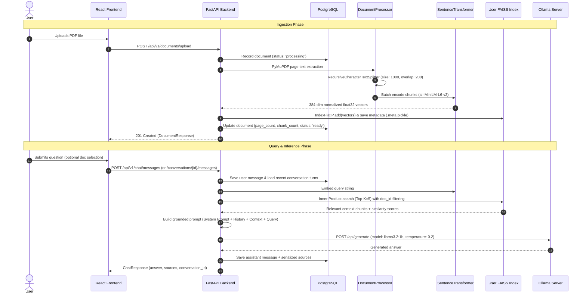
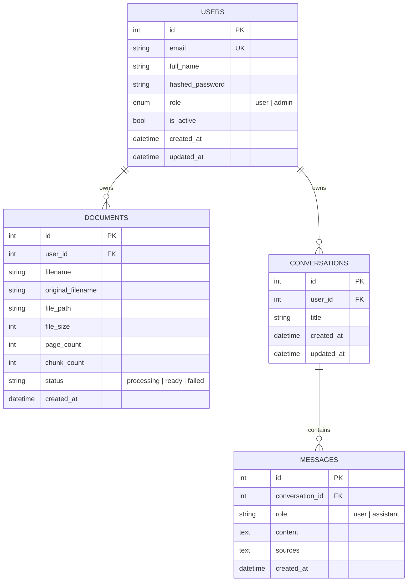

# Developer & Operational Notebook — VectorDoc

This document provides deep technical notes, architectural details, internal data flows, interview questions & answers, troubleshooting guidelines, and operational procedures for developing, deploying, and explaining the `VectorDoc` codebase.

---

## 1. Complete Project Workflow

VectorDoc is an end-to-end, privacy-first Retrieval-Augmented Generation (RAG) system that operates entirely on local infrastructure without external cloud API dependencies.



### 1.1 Ingestion Workflow (Upload to Vector Index)
1. **File Validation & Upload**: The user uploads a `.pdf` file via the frontend. The backend validates file type and enforces size limits (`MAX_UPLOAD_SIZE_MB=25`).
2. **Page-by-Page Extraction**: PyMuPDF (`fitz`) parses the PDF page by page to retain exact 1-indexed page coordinates for each text segment.
3. **Recursive Chunking**: Text is split into overlapping chunks (`chunk_size=1000`, `chunk_overlap=200`) respecting natural linguistic boundaries (`\n\n`, `\n`, `. `, ` `).
4. **Vector Embedding**: Chunks are passed in batches to `all-MiniLM-L6-v2` generating 384-dimensional dense vectors.
5. **Index Storage & Isolation**: Embeddings are $L_2$-normalized and stored in the user's isolated FAISS index (`user_{user_id}.index`), while chunk metadata (document ID, page number, text excerpt) is stored in `user_{user_id}.meta`.
6. **DB Record**: PostgreSQL updates document status from `processing` to `ready`.

### 1.2 Retrieval & Generation Workflow (Query to Response)
1. **Query Embedding**: When the user asks a question, the backend embeds the query string using the same `all-MiniLM-L6-v2` model.
2. **Top-$K$ Vector Search**: The FAISS index performs an inner product search (cosine similarity) to find the top $K=5$ most relevant chunks. If the user selected specific documents in the UI, candidate chunks are filtered by `document_id`.
3. **Prompt Construction**: A strict grounded system prompt combines:
   - Strict hallucination prevention rules (must only answer from context).
   - Conversation history (last 6 messages).
   - Retrieved context chunks with page citations.
   - User query.
4. **Local LLM Inference**: The prompt is dispatched to Ollama (`llama3.2:1b`, temperature: 0.2).
5. **Persistence & Citation Delivery**: The assistant's response along with document sources, page numbers, similarity scores, and excerpts are saved to PostgreSQL and returned to the frontend.

---

## 2. Comprehensive Interview Questions & Answers

### Q1: Why did you build this project? What problem does it solve?
> **Answer:**
> "Modern organizations and individuals handle sensitive PDFs (financial statements, legal contracts, medical reports, internal documentation) that cannot be sent to third-party cloud LLMs like OpenAI or Claude due to privacy compliance (GDPR, HIPAA, corporate confidentiality) and high API costs.
> 
> I built **VectorDoc** to solve three core problems:
> 1. **100% Data Privacy**: Runs completely offline and on-premise using open-source models (Sentence-Transformers + Ollama).
> 2. **Eliminating Hallucinations with Citations**: Instead of guessing, the LLM is strictly grounded in retrieved document chunks, returning the exact document name, page number, and similarity score for transparency.
> 3. **Per-User Isolation**: Vector data and uploaded files are strictly compartmentalized per authenticated user."

---

### Q2: Why did you choose this specific tech stack?

#### 1. FastAPI (vs Flask / Django)
- **Asynchronous Performance**: Built on ASGI (Starlette/Uvicorn), enabling non-blocking I/O for handling long-running inference requests and cancellation polling.
- **Automatic Validation & OpenAPI Docs**: Pydantic v2 schemas provide strict type validation and auto-generate Swagger UI (`/docs`).
- **Dependency Injection**: Clean, testable DI for database sessions, current user authentication, and service orchestration.

#### 2. React + Vite + Tailwind CSS (vs Next.js / Vanilla JS)
- **Fast Development & Lightweight Bundle**: Vite provides instant HMR and tiny production bundles without server-side rendering overhead.
- **Component Reusability**: Modularity between chat panel, conversation sidebar, document manager, and auth flows.
- **Tailwind CSS & Framer Motion**: Delivers a modern dark-mode UI with micro-animations and zero runtime CSS overhead.

#### 3. PostgreSQL (vs MongoDB / SQLite)
- **Relational Integrity**: Enforces foreign keys and `CASCADE` deletions (e.g., deleting a user cleanly deletes their documents, conversations, and messages).
- **ACID Compliance**: Safe transactional state for multi-step operations like document uploads and message logging.
- **Production-Ready**: Seamlessly scales from local development in Docker to managed cloud DBs (AWS RDS, Supabase).

#### 4. FAISS (vs ChromaDB / Pinecone / Qdrant)
- **Zero Network Overhead & Millisecond Speed**: FAISS runs in-process with C++ bindings, eliminating remote HTTP latency.
- **Per-User File Isolation**: Instead of a shared multi-tenant database requiring complex RBAC filters, each user has their own `user_{id}.index` and `user_{id}.meta` file.
- **Cost**: 100% free and open-source without third-party subscription fees.

#### 5. Sentence-Transformers `all-MiniLM-L6-v2` (vs OpenAI `text-embedding-3`)
- **Lightweight & Fast**: Produces 384-dimensional embeddings (vs 1536/3072 in OpenAI), computing in ~10–20ms on standard CPUs.
- **Zero API Dependency**: Model weights download once and run completely offline in memory via a singleton pattern.
- **High Quality**: Excellent semantic retrieval performance for English text benchmarks.

#### 6. Ollama (`llama3.2:1b`) (vs Cloud LLM APIs)
- **Resource Efficiency**: `llama3.2:1b` requires < 2 GB RAM, making it responsive on standard CPU laptops without requiring an expensive GPU.
- **Deterministic & Grounded**: Configured with `temperature: 0.2` and strict system prompts for accurate RAG Q&A.

---

### Q3: What is RAG and why is it better than fine-tuning for document Q&A?
> **Answer:**
> "RAG (Retrieval-Augmented Generation) separates knowledge storage from model weights. Instead of training or fine-tuning an LLM on documents:
> 1. **Immediate Updates**: Uploading a new PDF makes it searchable in seconds without hours of retraining or compute costs.
> 2. **Verifiable Citations**: Fine-tuned models generate text from memory and cannot cite exact page numbers or excerpts. RAG retrieves the raw text chunks and quotes the exact page.
> 3. **Hallucination Reduction**: The model is instructed to answer *only* from the provided context chunks.
> 4. **Access Control**: Fine-tuning bakes knowledge into weights where all users can access it. RAG enables per-user vector filtering."

---

### Q4: How does your text chunking strategy work, and why not use fixed-size chunking?
> **Answer:**
> "Fixed-size chunking (e.g., splitting every 500 characters) cuts words, sentences, and paragraphs in half, destroying semantic context.
> 
> I implemented `RecursiveCharacterTextSplitter`:
> - **Hierarchy of Separators**: `["\n\n", "\n", ". ", " ", ""]`.
> - **Logic**: It looks for the largest natural boundary (paragraphs first, then line breaks, then sentence periods) before hitting the character limit (`1000` chars).
> - **Chunk Overlap**: An overlap of `200` characters is applied so that concepts spanning chunk boundaries are preserved in both neighboring vectors."

---

### Q5: How is vector similarity calculated in FAISS?
> **Answer:**
> "We use `faiss.IndexFlatIP` (Inner Product).
> Before adding embeddings or querying, we apply $L_2$ normalization (`faiss.normalize_L2(vectors)`).
> 
> Mathematically, the inner product of two $L_2$-normalized unit vectors equals their **cosine similarity**:
> $$\text{Cosine Similarity} = \frac{u \cdot v}{\|u\|_2 \|v\|_2} = u \cdot v \quad (\text{when } \|u\|=\|v\|=1)$$
> 
> This gives exact cosine similarity scores bounded between $-1.0$ and $+1.0$ with zero computational overhead."

---

### Q6: How does document deletion work in FAISS?
> **Answer:**
> "Flat FAISS indexes store contiguous arrays of vectors and do not support dynamic key-based removal out of the box.
> In VectorDoc:
> 1. When `DELETE /api/v1/documents/{id}` is called, we filter out all chunks matching `document_id` from `user_{id}.meta`.
> 2. If remaining chunks exist, we re-encode the remaining chunks and re-create a clean `IndexFlatIP` index.
> 3. If no documents remain, we delete the `.index` and `.meta` files from disk.
> 4. We delete the database record and the raw PDF file from disk."

---

### Q7: How do you handle generation cancellation / aborting?
> **Answer:**
> "When a user asks a question, generating the response on CPU can take a few seconds. If the user clicks 'Stop' or navigates away:
> 1. **Frontend**: The `AbortController` triggers `controller.abort()`, cancelling the HTTP request.
> 2. **Backend**: In `app/routers/chat.py`, the chat logic runs in an `asyncio.create_task()`.
> 3. **Disconnect Polling**: A loop checks `await request.is_disconnected()`. When the client disconnects, `task.cancel()` is invoked immediately, stopping the Ollama network call and rolling back the database transaction."

---

### Q8: How would you scale this architecture to 100,000+ users?
> **Answer:**
> 1. **Vector Database**: Migrate from local file-based FAISS to a distributed vector database like **Qdrant** or **Pgvector** (PostgreSQL extension) with HNSW indexing and metadata filtering per `tenant_id`.
> 2. **Asynchronous Ingestion Queue**: Move PDF parsing and embedding to background Celery / Redis workers with webhooks/WebSockets notifying the frontend when a document is 'Ready'.
> 3. **LLM Inference Cluster**: Deploy Ollama or vLLM / TGI on GPU-accelerated nodes behind a load balancer (e.g., Ray Serve or Triton).
> 4. **Object Storage**: Store raw PDF files in AWS S3 or MinIO instead of local disk volumes.
> 5. **Caching**: Use Redis to cache query embeddings and frequent question-answer pairs.

---

## 3. Component Deep-Dive

### 3.1 Text Extraction & Chunking (`app/services/rag.py`)
- **PyMuPDF (`fitz`)**: Fast PDF parser extracting text page-by-page to retain 1-indexed page references for citations.
- **`RecursiveCharacterTextSplitter`**:
  - Separator hierarchy: `["\n\n", "\n", ". ", " ", ""]`
  - Logic: Scans within `[start, start + chunk_size]` for the largest natural separator boundary before falling back to a character break.
  - Overlap: Shifts `start = max(end - overlap, start + 1)` to maintain semantic continuity across chunk boundaries.

### 3.2 Embeddings & FAISS Vector Store
- **Embedding Model**: `sentence-transformers/all-MiniLM-L6-v2`
  - Dimension: 384
  - Singleton pattern via `EmbeddingService._model` to avoid reloading model weights on each request.
- **FAISS Configuration**:
  - `faiss.IndexFlatIP(384)`: Inner product metric on L2-normalized vectors mathematically equals cosine similarity ($S_C = u \cdot v$).
  - Per-user isolation: Each user has two files under `FAISS_INDEX_DIR`:
    - `user_{user_id}.index` — Binary FAISS index.
    - `user_{user_id}.meta` — Python `pickle` containing chunk text, `page_number`, `chunk_index`, `document_id`, and `document_name`.

### 3.3 LLM Generation & Ollama Integration
- **Default Model**: `llama3.2:1b`
- **Request Parameters**:
  - `temperature`: 0.2 (low temperature for deterministic, factual outputs).
  - `num_predict`: 160 tokens (enforces concise answers).
  - `num_ctx`: 1536 tokens (sufficient context for top-5 chunks and 6 turns of history).
  - `keep_alive`: "30m" (keeps the model warm in memory between chat turns).
  - `timeout`: 180s (prevents premature timeouts during cold model loads).

---

## 4. Database Schema (PostgreSQL)



---

## 5. Operations & Debugging Cheat Sheet

### 5.1 Docker Management
```powershell
# Start all containers in background
docker compose -p rag-pdf-chatbot up --build -d

# Stop all containers
docker compose -p rag-pdf-chatbot down

# View running status
docker compose -p rag-pdf-chatbot ps

# View live backend logs
docker compose -p rag-pdf-chatbot logs -f backend

# View live Ollama logs
docker compose -p rag-pdf-chatbot logs -f ollama
```

### 5.2 Ollama Operations
```powershell
# List downloaded models
docker compose -p rag-pdf-chatbot exec ollama ollama list

# Pull a different model
docker compose -p rag-pdf-chatbot exec ollama ollama pull mistral:7b
```

### 5.3 PostgreSQL Inspection
```powershell
# View users
docker compose -p rag-pdf-chatbot exec db psql -U raguser -d rag_chatbot -c "SELECT id, email, full_name, role, is_active FROM users;"

# View uploaded documents
docker compose -p rag-pdf-chatbot exec db psql -U raguser -d rag_chatbot -c "SELECT id, user_id, original_filename, page_count, chunk_count, status FROM documents;"
```

### 5.4 User Management
```powershell
# Promote user to administrator
docker compose -p rag-pdf-chatbot exec backend python scripts/create_admin.py user@example.com
```
